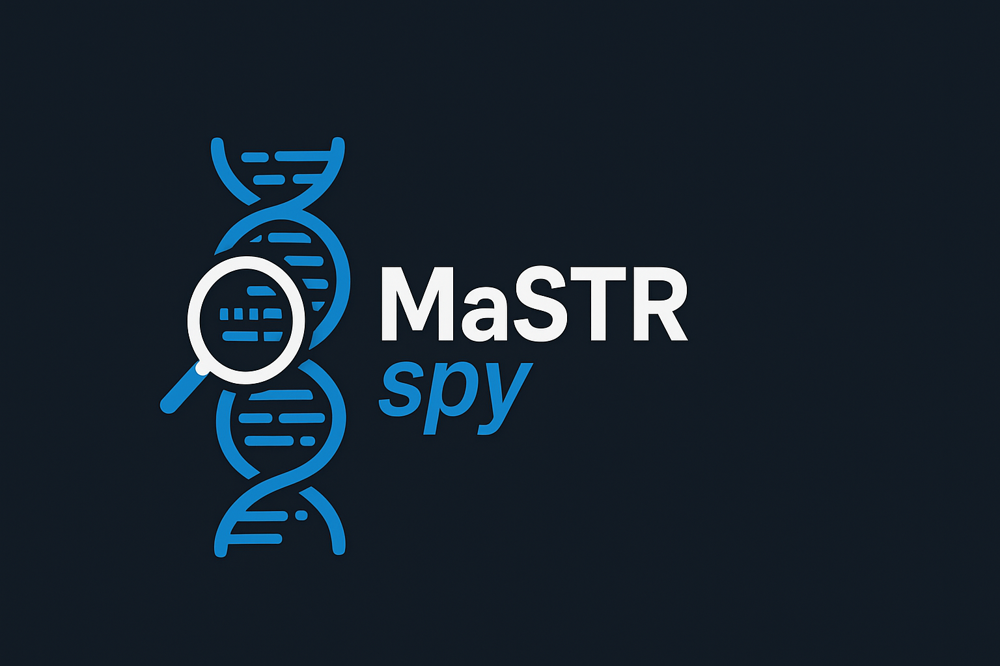
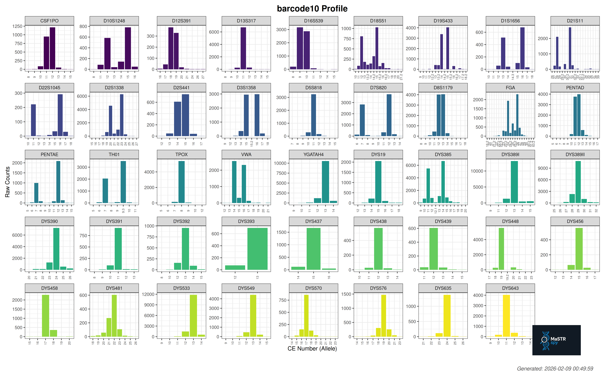

# MaSTRspy

<p align="center">
  
</p>

MaSTRspy is a GUI-based pipeline for forensic STR profiling from nanopore and long-read sequencing data. It accepts raw sequencing output (POD5, BAM, or FASTQ), filters reads for quality, aligns them to a 45-locus STR reference database (GRCh38), and produces per-sample allele calls, STR profiles, and plots.

**Compatibility:** Verified on Linux and macOS.

## Installation

### Recommended — conda (installs everything at once)

```bash
git clone https://github.com/DP-Genome/MaSTRspy.git
cd MaSTRspy
conda env create -f environment.yml
conda activate mastrspy
MaSTRspy setup
```

The `setup` command auto-detects all installed tools and writes their paths to `config/ToolsConfig.txt`.
run MaSTRspy `setup` after installing Dorado for to activate basecalling through the GUI

## Usage

Launch the GUI:

```bash
MaSTRspy activate
```

The wizard guides you through the following steps:

1. **File Selection** — point to your input folder; file type is detected automatically
2. **Experiment Setup** — name the run and choose an output folder
3. **Basecalling** *(POD5 only)* — select a Dorado model and demultiplexing kit
4. **Filtering** — choose a quality preset (Lenient / Moderate / Stringent) or set custom thresholds
5. **Analysis Options** — pick the STR database (RefSeq or UCSC), set normalization cutoff, configure threads, enable optional SNV calling
6. **Review** — confirm all settings
7. **Processing** — live log and progress
8. **Results** — browse summary tables, STR profiles, and allele plots

## Output

Results are saved to `<output_dir>/<experiment_name>/`:

```
<experiment_name>_YYYYMMDD_HHMMSS.log
4_analysis/
  Countings/
    Summaries/
      barcode01_summary.tsv
      barcode01_Profile.tsv
      combined_summary.tsv
    Plots/
      barcode01_profile.png
```

**Example output plot:**

<p align="center">
  
</p>

## STR Database

The pipeline includes 45 STR loci mapped to GRCh38, available in both RefSeq and UCSC coordinate systems. Select your preferred reference from the Analysis Options page.

**Autosomal:** CSF1PO, D10S1248, D12S391, D13S317, D16S539, D18S51, D19S433, D1S1656, D21S11, D22S1045, D2S1338, D2S441, D3S1358, D5S818, D7S820, D8S1179, FGA, PentaD, PentaE, TH01, TPOX, vWA

**Y-STR:** DYS19, DYS385, DYS389I, DYS389II, DYS390, DYS391, DYS392, DYS393, DYS437, DYS438, DYS439, DYS448, DYS456, DYS458, DYS481, DYS533, DYS549, DYS570, DYS576, DYS635, DYS643, YGATAH4

## Filter Presets

| Preset | Dorado QS | Mean Q | Min Length | Accuracy |
|--------|-----------|--------|------------|----------|
| Lenient | 8 | 8 | 100 bp | 0.80 |
| Moderate | 10 | 10 | 200 bp | 0.85 |
| Stringent | 12 | 12 | 300 bp | 0.90 |

---

## Manual Installation — pip + system tools

For users who prefer to manage their environment manually:

```bash
pip install .
```

Then install the required external tools separately:

| Tool | Purpose | Required |
|------|---------|----------|
| [samtools](https://www.htslib.org/) | BAM handling | Yes |
| [bedtools](https://bedtools.readthedocs.io/) | Genomic intervals | Yes |
| [minimap2](https://github.com/lh3/minimap2) | Read alignment | Yes |
| [dorado](https://github.com/nanoporetech/dorado) | Basecalling (POD5 input only) | Optional |
| [xatlas](https://github.com/broadinstitute/xatlas) | SNV calling | Optional |
| [Rscript](https://www.r-project.org/) | Profile plots | Optional |

> **Note:** dorado and xatlas are not available via conda. If you need basecalling (POD5 input) or SNV calling, install them manually from the links above. The pipeline will work without them — these features are simply skipped if the tools are not found.

## License

This project is licensed under the [MIT License](LICENSE).
